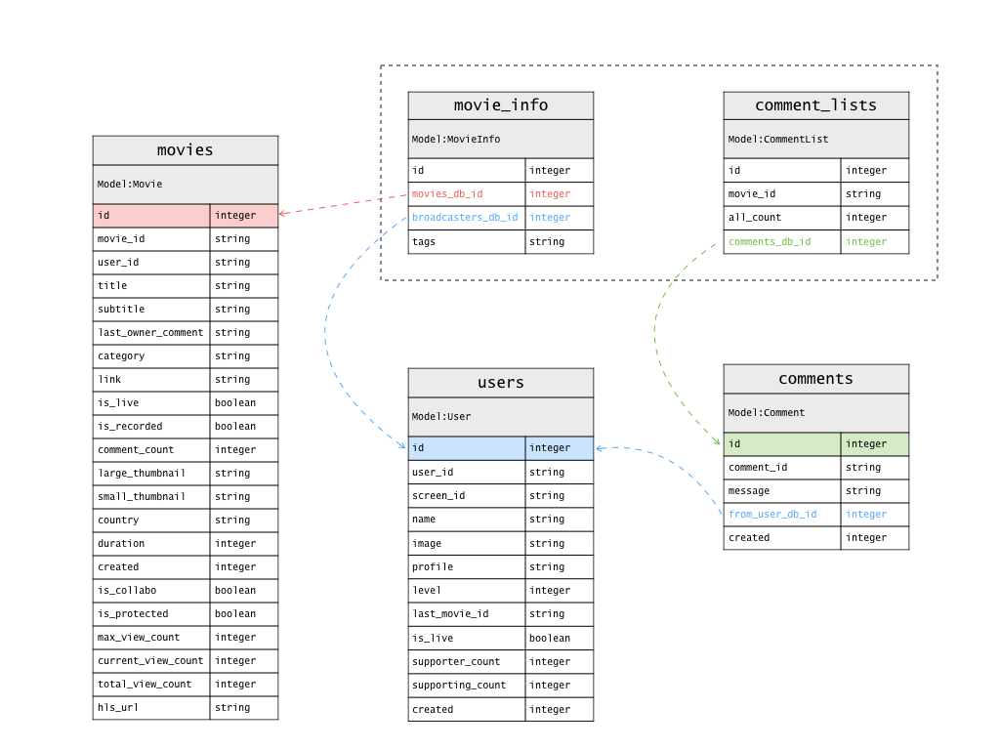

# tlarb

Ruby library for Twitcasting Live Analytics

## Installation

```rb
under construction
```

## Preparation before using

Before using tlarb, we need to get access token in order to access TwitCasting API (APIv2).
Because this library internally access to the API.
Please refer to README of [twicas_stream](https://github.com/ysato5654/twicas_stream)

## Usage

### 'Live Stream' mode

- by movie id

```rb
ruby live_stream.rb -m 189037369
```

- by user id

```rb
ruby live_stream.rb -u 182224938
```

## DB (Data Base)

### Directory structure

```
/db									  
└─	/#{year}						  
	└─	/#{month}					  
		└─	/#{day}					  
			└─	#{movie_id}.sqlite3	  
```

### Data base association



---

## Development

Here is for developer

### Preparation before developing

Before develop twicas_stream, we need to prepare as below.
Because example srouce code and test code need access

1. Create '/config' directory
2. Create 'access_token.txt' in there
3. Write your access token in that file

### tlarb

```rb
module Tlarb
	module Model
		class MovieInfo < ActiveRecord::Base
		end

		class CommentList < ActiveRecord::Base
		end

		class User < ActiveRecord::Base
		end

		class Movie < ActiveRecord::Base
		end

		class Comment < ActiveRecord::Base
		end
	end

	class Stream
	end
end
```

### Directory structure

```
/										  
├─	/app								  
│	└─	live_stream.rb					  
├─	/bin								  
├─	/config								  
│	├─	access_token.txt				  
│	└─	database.yml					  
├─	/db									  
├─	/lib								  
│	├─	/tlarb							  
│	│	├─	stream.rb					  
│	│	├─	models						  
│	│	│	├─	movie_info.rb			  
│	│	│	├─	comment_list.rb			  
│	│	│	├─	user.rb					  
│	│	│	├─	movie.rb				  
│	│	│	└─	comment.rb				  
│	│	├─	model.rb					  
│	│	├─	configure.rb				  
│	│	└─	version.rb					  
│	└─	tlarb.rb						  
├─	/log								  
├─	/spec								  
├─	LICENSE								  
└─	README.md							  
```

